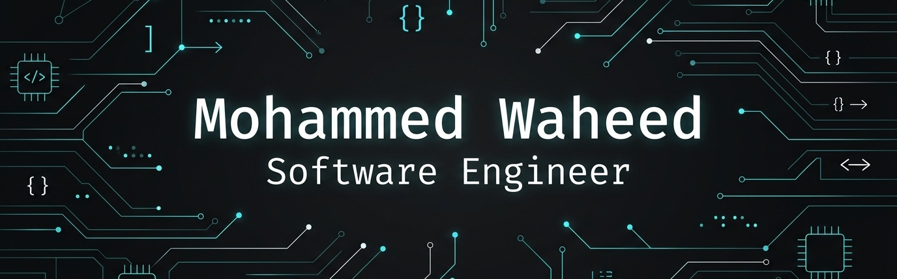

# Hi there, I'm Mohammed Waheed! 👋

  

  <strong>Software Engineer | MCA Graduate | AI & ML Developer</strong>

  
  
  

---

### 👨‍💻 About Me

I am a passionate **Software Developer** and **MCA graduate** from **Manipal Institute of Technology (MIT)**. I have a strong foundation in full-stack web development, Android applications, and machine learning. I enjoy writing clean, maintainable, and optimized code to solve complex, real-world problems.

- 🎓 **Education:** Master of Computer Applications (MCA) @ Manipal Institute of Technology (CGPA: 8.61)
- 💼 **Current / Recent:** Software Developer Intern @ DifferentTech Solutions (Mangalore)
- 🤖 **Interests:** Deep Learning, NLP, Generative AI (RAG models), Full-Stack Systems, and Intelligent Automation.
- 🚀 **Goal:** Building impactful, user-centric, and intelligent software systems.

---

### 🛠️ Technical Skills

<table>
  <tr>
    <td valign="top" width="50%">
      <h4>💻 Core Programming</h4>
      
      
      
      
    </td>
    <td valign="top" width="50%">
      <h4>🌐 Web & App Development</h4>
      
      
      
      
      
      
    </td>
  </tr>
  <tr>
    <td valign="top" width="50%">
      <h4>🤖 AI, Machine Learning & Analytics</h4>
      
      
      
      
      
      
    </td>
    <td valign="top" width="50%">
      <h4>🗄️ Databases & Tools</h4>
      
      
      
      
      
      
    </td>
  </tr>
</table>

---

### 📂 Featured Projects

Here are some of my top projects that showcase my software engineering, web, and AI skills:

#### 🩺 [Medical Report Hub – AI-Powered Lab Report Analyzer](https://github.com/Waheexd/Medical-Report-Hub)
* **Tech Stack:** Python, Streamlit, Groq (Llama-3), PyMuPDF, HuggingFace, FAISS
* **Description:** An advanced AI-powered web application using Retrieval-Augmented Generation (RAG) to analyze medical data from PDFs and images. Features automatic abnormal value detection, multi-lingual plain-language summaries, and an interactive chat assistant.

#### 🏸 [ShuttleScore – Badminton Scoring App](https://www.linkedin.com/feed/update/urn:li:activity:7390035461412483072/)
* **Tech Stack:** Android Studio, Java, SQLite
* **Description:** A native Android application for real-time badminton score tracking with configurable match formats, player management, and local match history storage.

#### 📉 [Customer Churn Analysis & Prediction System](https://github.com/Waheexd/Churn-Analysis.git)
* **Tech Stack:** Python (Pandas, NumPy, Scikit-learn), Matplotlib, Seaborn, Power BI, DAX
* **Description:** An end-to-end machine learning pipeline analyzing customer behavior, predicting churn risk with high accuracy, and visualizing retention strategies via interactive Power BI dashboards.

#### 🏥 [Patient Readmission Prediction System](https://github.com/Waheexd/Patient-Readmission-Prediction-System-and-Dashboard.git)
* **Tech Stack:** PySpark, Pandas, Matplotlib, Seaborn, Power BI
* **Description:** A scalable, end-to-end PySpark-based machine learning pipeline analyzing and predicting diabetic hospital readmissions using UCI dataset, backed by a detailed dashboard.

#### 🎓 [LearNexus E-Learning Platform](https://github.com/Waheexd/learnNexus-Project.git)
* **Tech Stack:** HTML, CSS, JavaScript, Bootstrap, PHP, MySQL
* **Description:** A responsive, modern e-learning platform featuring secure authentication, quiz modules with score validations, and a rule-based support chatbot.

#### 🛡️ Research Project: Deepfake Video Detection
* **Tech Stack:** Python, TensorFlow/Keras, CNN, ResNet-50, LSTM, OpenCV, MATLAB
* **Description:** Developed a transfer learning–based CNN–LSTM architecture combining ResNet-50 for spatial feature extraction and LSTM for temporal sequence modeling in deepfake video detection.

---

### 💼 Experience & Professional Journey

* **DifferentTech Solutions, Mangalore** | *Software Developer Intern* (Feb 2026 - Nov 2026)
  * Developed and enhanced an **Equipment Rental Management System** using Spring Boot, MySQL, and Angular.
  * Implemented core modules such as **Vendor Management** (CRUD operations) and **insights dashboards**.
  * Led report migration projects, converting legacy MS Access reporting systems into modern **JasperReports** (improving speed, layout structure, and data validation accuracy).

---

### 📊 GitHub Stats & Streaks

  
  

  

---

### 📬 Connect With Me!

Let's collaborate or chat about software engineering, AI, or web dev!

* 🌐 **Portfolio Site:** [waheexd-portfolio.netlify.app](https://waheexd-portfolio.netlify.app)
* 💼 **LinkedIn:** [Mohammed Waheed](https://www.linkedin.com/in/mohammed-waheed-whd3/)
* 📧 **Email:** [mohdwhd3@gmail.com](mailto:mohdwhd3@gmail.com)
* 🐱 **GitHub Profile:** [@Waheexd](https://github.com/Waheexd)

  <i>"Building the future, one line of code at a time."</i>

